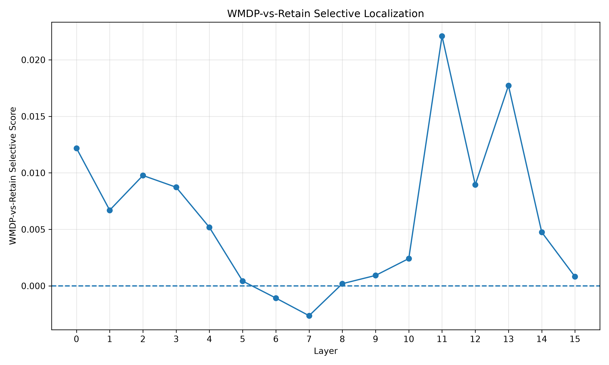
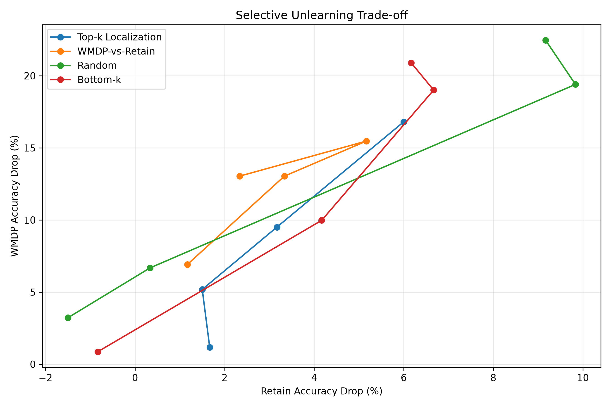
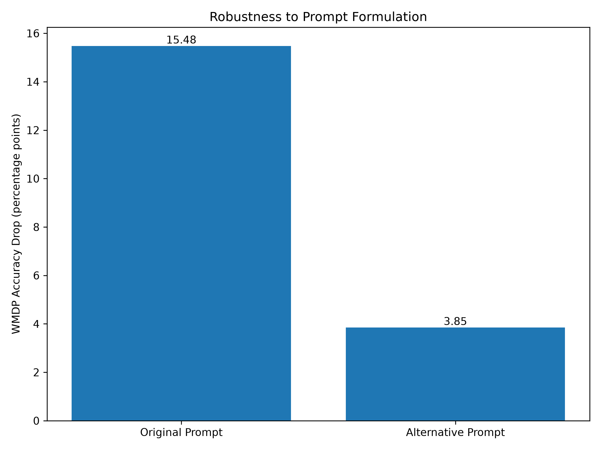

# Mechanistic Interpretability for Selective Machine Unlearning

---

## Overview

This project studies whether internal signals of a language model can help us find better layers for selective machine unlearning.

The main goal is to reduce the model's performance on WMDP-Bio while keeping its general knowledge as stable as possible.

Instead of retraining the model, we first analyze the internal behavior of its layers. We then select layers based on the localization results and apply a causal intervention to their activations.

We compare the selected layers with several control groups, including randomly selected layers and layers with low localization scores.

> [!NOTE]
> **Main experimental goal:** reduce WMDP-Bio performance while keeping general Retain performance as stable as possible.

### Project at a Glance

| Component | Choice |
| --- | --- |
| **Model** | `Llama-3.2-1B-Instruct` |
| **Forget dataset** | `WMDP-Bio` |
| **Retain dataset** | `MMLU` |
| **Localization** | `Residual-Update L2` |
| **Intervention** | `Residual-update scaling` |

The project uses:

- **Model:** Llama-3.2-1B-Instruct
- **Forget dataset:** WMDP-Bio
- **Retain dataset:** MMLU
- **Localization method:** Residual-Update L2
- **Intervention:** Residual-update scaling


---

## Research Question

The main research question is:

> Can mechanistic localization identify better intervention targets for selective unlearning than random layer selection?

To study this question, we measure two goals:

1. **Forgetting:** How much the intervention reduces accuracy on WMDP-Bio.
2. **Utility preservation:** How much general performance is preserved on the Retain dataset.

A useful intervention should reduce WMDP-Bio performance while causing as little damage as possible to general model performance.

## Main Idea

The experiment has four main steps:

1. Measure the activity of every model layer on WMDP-Bio.
2. Compare the layer activity on WMDP-Bio with the activity on the Retain dataset.
3. Select layers using the localization scores and apply a causal intervention.
4. Compare the results with random and low-scoring layer controls.

We also test several intervention strengths, perform an additional causal validation analysis, and test the main result with an alternative prompt formulation.


---

## Experimental Setup

### Model

The experiments use **Llama-3.2-1B-Instruct**, a small open causal language model.

A relatively small model was selected because all experiments were executed locally on a laptop GPU. The model was loaded using FP16 to reduce GPU memory usage.

No training from scratch was performed. The experiments only analyze the existing model and apply activation interventions during inference.

### Forget Dataset

The forget dataset is **WMDP-Bio**, from the WMDP benchmark.

The full test split was used:

- **Dataset:** WMDP-Bio
- **Number of examples:** 1,273
- **Task:** Multiple-choice questions
- **Possible answers:** A, B, C, or D

The baseline WMDP-Bio accuracy was:

**46.03% (586 / 1,273)**

### Retain Dataset

The Retain dataset was created from **MMLU**.

The goal of this dataset is to measure whether the intervention damages general model abilities that should be preserved.

Six subjects were selected:

- Elementary Mathematics
- Formal Logic
- High School Geography
- High School World History
- High School Macroeconomics
- High School Computer Science

For each subject, 100 examples were randomly selected using a fixed random seed.

This gives:

**6 subjects × 100 examples = 600 Retain examples**

The random seed used in the experiments was:

```text
42

```

The baseline Retain accuracy was:

**33.33% (200 / 600)**

Biology subjects were not included in the main Retain set. This helps separate the WMDP-Bio target from the general utility evaluation.

### Evaluation Method

Both WMDP-Bio and the Retain dataset use the same multiple-choice evaluation method.

For each question, the model receives the question and four possible answers.

The model is asked to answer with only:

```text
A, B, C, or D

```

Instead of generating a full answer, the evaluator reads the model's next-token logits.

The scores of the four candidate tokens are compared, and the answer with the highest score is selected as the model prediction.

This allows all four answers to be scored using one forward pass.

The same evaluation method is used for the baseline and intervention experiments.


---

## Hardware and Environment

All experiments were executed locally on a laptop.

Main hardware:

- **GPU:** NVIDIA GeForce GTX 1650 Ti Max-Q
- **Dedicated GPU memory:** 4 GB VRAM
- **System memory:** approximately 16 GB RAM
- **Operating system:** Windows

Main software:

- **Python:** 3.11
- **PyTorch**
- **Transformers**
- **Datasets**
- **Accelerate**
- **Pandas**
- **Matplotlib**
- **CUDA**

Because the GPU has only 4 GB of dedicated VRAM, the model was loaded using FP16 and the evaluation was performed sequentially.

This hardware limitation had a large effect on experiment time. For example, the full intervention experiment included:

**4 methods × 4 intervention strengths × 1,873 evaluation examples = 29,968 forward passes**

As a result, the full intervention experiment required several hours to complete.

Checkpoint results were saved after each intervention condition. This was useful because long local experiments can be affected by memory pressure or interrupted runs.


---

## Installation

Clone the repository:

```powershell
git clone https://github.com/yair323bar/Mechanistic-Interpretability-Machine-Unlearning.git

```

Move into the project:

```powershell
cd Mechanistic-Interpretability-Machine-Unlearning

```

Create a virtual environment:

```powershell
python -m venv .venv

```

Activate it on Windows PowerShell:

```powershell
.\.venv\Scripts\Activate.ps1

```

Install the required packages:

```powershell
pip install -r requirements.txt

```

The model is downloaded from Hugging Face when the experiment is executed. Access to the Llama model may require an approved Hugging Face account and authentication.


---

## How to Run

The experiments can be executed in the following order.

### 1. WMDP-Bio Baseline

```powershell
python experiments/baseline_wmdp.py

```

Evaluates the original model on the full WMDP-Bio test set and saves the baseline predictions.

### 2. Retain Baseline

```powershell
python experiments/baseline_retain.py

```

Builds the MMLU Retain set and evaluates the original model on the 600 selected examples.

### 3. Localization

```powershell
python experiments/localization.py

```

Measures the Residual-Update L2 localization score for every model layer on both WMDP-Bio and the Retain dataset.

### 4. Causal Intervention

```powershell
python experiments/intervention.py

```

Runs the causal intervention experiment using the localization groups, control groups, and different intervention strengths.

This is the longest experiment in the project.

### 5. Intervention Analysis

```powershell
python experiments/analyze_intervention.py

```

Processes the intervention results and creates the intervention-strength and selectivity plots.

### 6. Causal Validation

```powershell
python experiments/causal_validation.py

```

Analyzes Retain performance separately for each subject under the selected intervention.

### 7. Robustness Test

```powershell
python experiments/robustness.py

```

Repeats the main WMDP evaluation using an alternative prompt formulation.

### 8. Localization Analysis

```powershell
python experiments/analyze_localization.py

```

Creates the WMDP localization and WMDP-vs-Retain localization plots.

### 9. Final Analysis

```powershell
python experiments/final_analysis.py

```

Creates the final result tables and the robustness comparison figure.


---

## Localization Method

### Initial Method: Hidden-State L2

The first localization method tested in this project was based on the L2 norm of the hidden state.

For each layer, the score was calculated over the tokens of the input and then averaged over the dataset.

The main idea was simple:

> If a layer has a large hidden-state magnitude on WMDP-Bio examples, it may be more involved in processing these examples.

However, the pilot experiment showed a problem with this method.

The hidden-state magnitude increased strongly in the later parts of the model. The final layer had a very large score compared with most earlier layers.

This suggested that the score was strongly affected by the scale of the accumulated residual stream.

Because of this, a high hidden-state norm did not necessarily mean that the current layer itself made a large change to the representation.

### Why the Localization Method Was Changed

To reduce this layer-scale effect, the localization method was changed from the full hidden-state magnitude to the change produced by each transformer block.

For layer $l$, the residual update is defined as:

$$\Delta h_{l,t} = h_{l+1,t} - h_{l,t}$$

where:

- $h_{l,t}$ is the hidden representation before the layer update.
- $h_{l+1,t}$ is the representation after the layer update.
- $t$ is the token position.

Instead of measuring how large the complete representation is, this measures how much the layer changes the representation.

### Residual-Update L2

The localization score for one example is:

$$s_l(x) = \frac{1}{T}\sum_{t=1}^{T}\left\|\Delta h_{l,t}\right\|_2$$

where $T$ is the number of tokens in the input.

The dataset-level score is:

$$S_l(D) = \frac{1}{|D|}\sum_{x \in D}s_l(x)$$

This score was calculated separately for:

- WMDP-Bio
- Retain

This method does not prove that knowledge is stored in a specific layer.

It only measures how strongly each transformer block changes the internal representation for the evaluated examples.

### WMDP Localization

The WMDP localization score showed that the largest residual updates were found in:

1. Layer 15
2. Layer 14

These layers were therefore selected as the **Top-k Localization** group:

```text
[15, 14]

```

with:

```text
k = 2

```

However, a large WMDP score alone does not show that a layer is specific to WMDP.

A layer may also have a large update for normal general-knowledge questions.

### WMDP-vs-Retain Localization

To measure relative WMDP selectivity, the WMDP score was compared with the Retain score.

The selective score is:

$$C_l = \frac{S_l(\text{WMDP}) - S_l(\text{Retain})}{S_l(\text{WMDP}) + S_l(\text{Retain}) + \epsilon}$$

A positive score means that the layer produced a relatively larger residual update on WMDP-Bio than on the Retain dataset.

The two highest selective scores were found at:

```text
Layer 11
Layer 13

```

These layers were selected as the **WMDP-vs-Retain** intervention group:

```text
[11, 13]

```

An important observation is that Layer 15 had the largest raw WMDP residual-update score, but it did not have a high selective score.

This suggests that a large activation update does not automatically mean that the layer is specific to WMDP behavior.

### Selective Localization Result

The following figure shows the WMDP-vs-Retain score across the model layers:



Layers 11 and 13 have the largest positive selective scores.

The differences are relatively small, so these results should be treated as localization signals rather than proof that WMDP knowledge is stored in these layers.


---

## Control Groups

Localization alone is not enough to show causal importance.

To test whether the selected layers are better intervention targets, four layer groups were compared.

| Method | Layers | Selection |
| --- | ---: | --- |
| **Top-k Localization** | `[15, 14]` | Highest WMDP Residual-Update L2 scores |
| **WMDP-vs-Retain** | `[11, 13]` | Highest selective scores |
| **Random** | `[3, 1]` | Random control |
| **Bottom-k** | `[0, 2]` | Lowest WMDP localization scores |

All groups use:

```text
k = 2

```

This keeps the intervention budget equal between the methods.

### Random Control

The Random group was selected using a fixed random seed:

```text
seed = 42

```

Layers already used by the Top-k, WMDP-vs-Retain, and Bottom-k groups were excluded before random selection.

The resulting random layers were:

```text
[3, 1]

```

The random layers were selected independently of their WMDP or Retain performance.

This control is important because a random intervention can also reduce model accuracy. Therefore, a WMDP accuracy drop by itself is not enough to show that localization found a meaningful causal target.


---

## Causal Intervention

After selecting the layers, a causal intervention was applied to the residual update of each selected transformer block.

For a selected layer:

$$\Delta h = h_{out} - h_{in}$$

The modified output is:

$$h' = h_{in} + \alpha \Delta h$$

The parameter $\alpha$ controls the intervention strength.

### Meaning of Alpha

When:

$$\alpha = 1$$

we get:

$$h' = h_{in} + (h_{out}-h_{in}) = h_{out}$$

so the model is unchanged.

When:

$$\alpha = 0$$

the complete residual update of the selected block is removed.

Intermediate values partially reduce the contribution of the selected layers.

### Intervention Strengths

The full experiment used:

```text
alpha = 0.75
alpha = 0.50
alpha = 0.25
alpha = 0.00

```

The unchanged model at:

```text
alpha = 1.00

```

is used as the baseline.

### Why Alpha 1.0 Was Not Repeated in the Full Sweep

Alpha 1.0 was not rerun for every intervention group in the full experiment.

This is because:

$$h_{in} + 1 \cdot (h_{out}-h_{in}) = h_{out}$$

so the intervention is exactly equal to the original model.

This identity was also checked in a small smoke test before the full experiment. With alpha 1.0, the intervention reproduced the original WMDP result on the test examples.

Because of this, the already measured baseline was reused for alpha 1.0 instead of performing redundant full-model evaluations.


---

## Implementation Validation

Before running the full intervention sweep, a small smoke test was performed.

The goal was to check that:

- the intervention hooks were active,
- alpha 1.0 reproduced the unchanged model,
- changing alpha changed model predictions,
- the experiment could run before starting the long full evaluation.

This test was useful because the full experiment required many forward passes and several hours on the available laptop hardware.


---

## Results

### Main Comparison

The baseline model achieved:

- **WMDP-Bio Accuracy:** 46.03%
- **Retain Accuracy:** 33.33%

The following table compares all layer-selection methods using the same intervention strength:

```text
alpha = 0.25
k = 2

```

Using the same alpha and the same number of intervened layers gives a direct comparison between the methods.

| Method | Layers | WMDP Accuracy | Delta WMDP | Retain Accuracy | Delta Retain |
| --- | ---: | ---: | ---: | ---: | ---: |
| **Baseline** | - | **46.03%** | 0.00 pp | **33.33%** | 0.00 pp |
| **Top-k Localization** | `[15, 14]` | 36.53% | 9.51 pp | 30.17% | 3.17 pp |
| **WMDP-vs-Retain** | `[11, 13]` | **30.56%** | **15.48 pp** | **28.17%** | **5.17 pp** |
| **Random** | `[3, 1]` | 26.63% | 19.40 pp | 23.50% | 9.83 pp |
| **Bottom-k** | `[0, 2]` | 27.02% | 19.01 pp | 26.67% | 6.67 pp |

Here, a positive delta means that accuracy decreased after the intervention.

The WMDP-vs-Retain method reduced WMDP accuracy by **15.48 percentage points**, while Retain accuracy decreased by **5.17 percentage points**.

However, the Random and Bottom-k controls produced even larger WMDP reductions.

This is an important result. It shows that a large WMDP reduction alone cannot be used as evidence that the localization method found a uniquely important WMDP layer.

### Intervention Strength

The experiment was not limited to one intervention strength.

Each layer group was evaluated using:

```text
alpha = 0.75, 0.50, 0.25, 0.00

```

The complete results are available in:

```text
results/all_strengths_table.csv

```

The results show that stronger intervention does not always produce a simple or monotonic change in accuracy.

For example, for the WMDP-vs-Retain layers:

| Alpha | WMDP Accuracy | Delta WMDP | Retain Accuracy | Delta Retain |
| ---: | ---: | ---: | ---: | ---: |
| `0.75` | 39.12% | 6.91 pp | 32.17% | 1.17 pp |
| `0.50` | 32.99% | 13.04 pp | 30.00% | 3.33 pp |
| `0.25` | **30.56%** | **15.48 pp** | 28.17% | 5.17 pp |
| `0.00` | 32.99% | 13.04 pp | 31.00% | 2.33 pp |

The strongest intervention, alpha 0.00, did not produce the largest WMDP reduction.

This suggests that the effect of changing internal representations is not simply linear.

### Forgetting vs Utility Trade-off

For selective unlearning, the goal is not only to reduce WMDP accuracy.

The intervention should also preserve as much Retain performance as possible.

The following figure compares WMDP degradation with Retain degradation:



Points with a larger WMDP reduction and a smaller Retain reduction represent a better forgetting-utility trade-off.

The WMDP-vs-Retain localization produced useful trade-offs at several intervention strengths.

For example, at alpha 0.50:

- WMDP decreased by **13.04 percentage points**
- Retain decreased by **3.33 percentage points**

At alpha 0.25:

- WMDP decreased by **15.48 percentage points**
- Retain decreased by **5.17 percentage points**

Random intervention could produce a larger WMDP reduction, but stronger random interventions also caused more damage to the Retain set.

At alpha 0.00, for example, the Random intervention reduced WMDP by **22.47 percentage points**, but also reduced Retain by **9.17 percentage points**.

These results suggest that intervention quality should be evaluated using both Forget and Retain performance, rather than only the WMDP reduction.


---

## Causal Validation

A reduction in WMDP accuracy is not enough to prove selective unlearning.

One possible explanation is that the intervention simply damages general model abilities.

To examine this possibility, the Retain dataset was analyzed separately for each MMLU subject.

The WMDP-vs-Retain intervention was tested using:

```text
layers = [11, 13]
alpha = 0.25

```

The results were:

As in the main experiment, a **positive Delta Retain means performance decreased** after the intervention.

| Retain Subject | Baseline | Intervention | Delta Retain |
| --- | ---: | ---: | ---: |
| Elementary Mathematics | 19% | 19% | 0 pp |
| Formal Logic | 30% | 30% | 0 pp |
| High School Geography | 38% | 34% | 4 pp |
| High School World History | 50% | 39% | 11 pp |
| High School Macroeconomics | 25% | 28% | -3 pp |
| High School Computer Science | 38% | 26% | 12 pp |

The intervention did not reduce every general capability in the same way.

Elementary Mathematics and Formal Logic were unchanged, while larger reductions were observed in World History and Computer Science.

This suggests that the intervention is not simply causing the same level of general degradation across all tasks.

However, the large reductions in some Retain subjects also show that the intervention is not fully selective.

The small increase in Macroeconomics should not be interpreted as an improvement caused by unlearning. It may be caused by normal evaluation variation.


---

## Robustness to Prompt Formulation

The main experiment used one fixed multiple-choice prompt.

To test whether the intervention effect depends on the exact prompt, WMDP-Bio was evaluated again using an alternative prompt formulation.

The model, dataset, selected layers, and intervention strength remained the same.

Only the prompt formulation was changed.

The results were:

| Prompt | Baseline WMDP | Intervention WMDP | Delta WMDP |
| --- | ---: | ---: | ---: |
| **Original Prompt** | 46.03% | 30.56% | **15.48 pp** |
| **Alternative Prompt** | 43.21% | 39.36% | **3.85 pp** |



The intervention reduced WMDP accuracy under both prompt formulations.

However, the effect was much smaller with the alternative prompt.

The WMDP reduction changed from **15.48 percentage points** to only **3.85 percentage points**.

This shows that the observed intervention effect is sensitive to prompt formulation.

> [!WARNING]
> The effect was much smaller with the alternative prompt. Therefore, the result should **not** be interpreted as robust removal of the target knowledge.


---

## Interpretation

The experiments provide mixed evidence for the main research question.

The WMDP-vs-Retain localization identified layers 11 and 13 as relatively more active for WMDP-Bio than for the Retain set.

Intervening on these layers produced a meaningful reduction in WMDP performance with a moderate reduction in Retain performance.

However, the Random and Bottom-k controls were also able to strongly reduce WMDP performance.

This means that the localization score does not reliably predict causal importance by itself.

The robustness experiment also showed that the intervention effect changes strongly when the prompt formulation is changed.

Together, these results suggest that mechanistic localization can provide useful intervention targets, but the current experiments do not show that these targets are consistently better than random layer selection.

The results also support the possibility that the behavior is distributed across several layers, and that residual-stream interventions can affect general reasoning in addition to the target behavior.


---

## Limitations

This study has several limitations that should be considered when interpreting the results.

### 1. Localization Does Not Prove Knowledge Location

A high localization score does not prove that specific knowledge is stored in a layer.

The Residual-Update L2 score only measures how strongly a transformer block changes the internal representation.

The causal intervention gives additional evidence, but the strong results from the Random and Bottom-k controls show that localization score alone is not enough to identify causal importance.

### 2. Distributed Representations

Information in language models can be distributed across many layers and components.

Because of this, changing only two layers may affect several behaviors at the same time.

It is also possible that different layers can partially compensate for each other.

### 3. General Model Degradation

Reducing WMDP accuracy does not automatically mean that the target information was selectively forgotten.

The intervention may also disrupt general reasoning or information processing.

The Retain evaluation helps measure this effect, but some MMLU subjects still showed significant performance degradation.

### 4. Prompt Sensitivity

The robustness experiment showed that the intervention effect depends strongly on prompt formulation.

With the original prompt, WMDP accuracy decreased by 15.48 percentage points.

With the alternative prompt, the reduction was only 3.85 percentage points.

This suggests that the intervention changes model behavior, but does not provide strong evidence that the target knowledge was removed in a prompt-independent way.

### 5. Low Retain Baseline

The baseline accuracy on the Retain dataset was 33.33%.

This relatively low baseline makes changes in Retain performance harder to interpret.

A stronger general-utility evaluation could provide a better measurement of collateral damage.

### 6. Single Model

All experiments were performed using Llama-3.2-1B-Instruct.

The same localization and intervention methods may behave differently on other models or larger language models.

Therefore, the results should not be assumed to generalize to other architectures or model sizes.

### 7. Limited Hardware

The experiments were executed locally on a GTX 1650 Ti Max-Q GPU with 4 GB VRAM.

This limited the size of the model and made large experiment sweeps expensive in runtime.

The project therefore focuses on a simple localization method and inference-time interventions that do not require model retraining.


---

## Proposed Next Experiment

A useful next experiment would add a **benign biology control dataset**.

The current selective localization compares:

```text
WMDP-Bio vs General MMLU Retain

```

This tells us whether a layer responds differently to WMDP-Bio compared with general knowledge.

However, it does not tell us whether the difference is related specifically to harmful biosecurity knowledge or simply to biology-related content.

A stronger comparison would be:

```text
WMDP-Bio
vs
Benign Biology
vs
General Retain

```

For example, normal biology questions could be used as an additional control.

If an intervention strongly reduces WMDP-Bio performance while preserving both benign biology and general knowledge, this would provide stronger evidence for selective unlearning.

The same experiment should also be repeated using several prompt formulations.

This would help test whether the localization and intervention effects remain stable when the wording of the input changes.


---

## Repository Structure

The repository is organized into experiment scripts, result files, and supporting source code.

```text
Mechanistic-Interpretability-Machine-Unlearning/
│
├── experiments/
│   ├── baseline_wmdp.py
│   ├── baseline_retain.py
│   ├── localization.py
│   ├── intervention.py
│   ├── analyze_intervention.py
│   ├── causal_validation.py
│   ├── robustness.py
│   ├── analyze_localization.py
│   ├── final_analysis.py
│   └── test_*.py
│
├── results/
│   ├── wmdp_baseline_predictions.csv
│   ├── retain_baseline_predictions.csv
│   ├── localization_scores.csv
│   ├── intervention_results.csv
│   ├── causal_validation_results.csv
│   ├── robustness_results.csv
│   ├── all_strengths_table.csv
│   ├── final_results.csv
│   ├── wmdp_localization.png
│   ├── selective_localization.png
│   ├── selectivity_tradeoff.png
│   └── robustness_comparison.png
│
├── src/
├── requirements.txt
├── .gitignore
└── README.md

```

The test scripts were used as smoke tests before starting the full experiments.

They were used to verify model loading, dataset access, localization calculations, and intervention behavior before running the longer evaluations.


---

## Main Output Files

The main numerical results are stored in CSV files.

| File | Description |
| --- | --- |
| `wmdp_baseline_predictions.csv` | Per-example WMDP baseline predictions |
| `retain_baseline_predictions.csv` | Per-example Retain baseline predictions |
| `localization_scores.csv` | WMDP, Retain, and selective scores for every layer |
| `intervention_results.csv` | Results for every method and intervention strength |
| `all_strengths_table.csv` | Full intervention-strength comparison |
| `final_results.csv` | Fixed-strength comparison at alpha = 0.25 |
| `causal_validation_results.csv` | Retain results separated by MMLU subject |
| `robustness_results.csv` | Alternative-prompt robustness results |

The main figures are:

| Figure | Description |
| --- | --- |
| `wmdp_localization.png` | Residual-Update L2 score across layers |
| `selective_localization.png` | WMDP-vs-Retain selective localization |
| `selectivity_tradeoff.png` | WMDP degradation compared with Retain degradation |
| `robustness_comparison.png` | Original and alternative prompt comparison |


---

## Conclusion

This project studied whether mechanistic localization can identify useful targets for selective machine unlearning.

Residual-Update L2 was used to measure how strongly each transformer block changes the model's internal representation.

Comparing WMDP-Bio with the Retain dataset identified layers 11 and 13 as the most selective layers.

Intervening on these layers reduced WMDP performance while preserving part of the model's general performance.

However, Random and Bottom-k interventions also produced large WMDP reductions. In addition, the intervention effect became much smaller when the prompt formulation was changed.

Therefore, the results provide **partial evidence**, but not strong proof, that the current localization method finds better intervention targets than random layer selection.

The main result is that localization can provide useful candidate layers, but stronger causal validation and robustness testing are needed before the intervention can be considered selective unlearning.